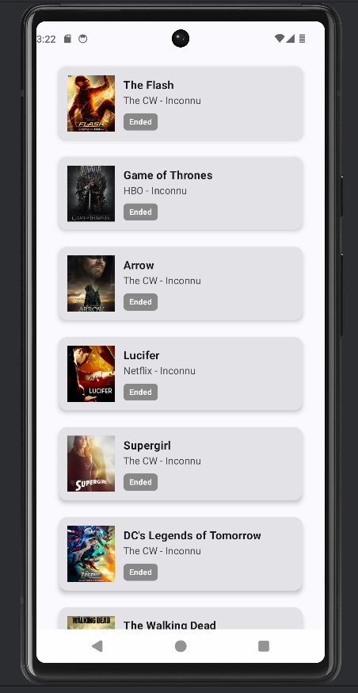
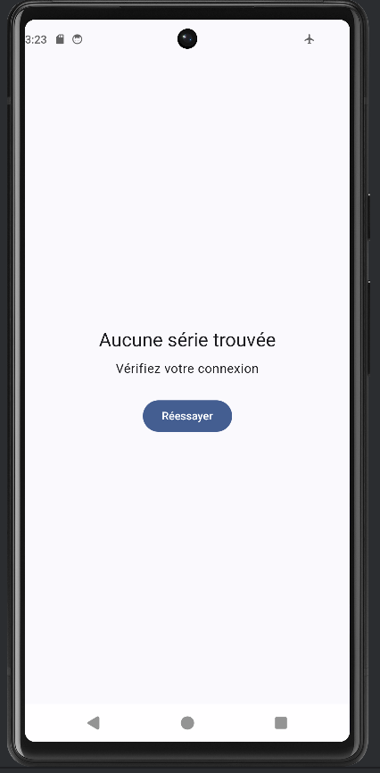
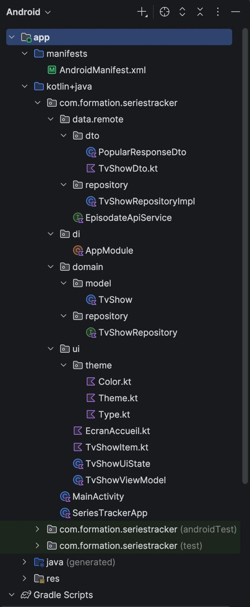

# Series Tracker - Application Android
## Introduction
Bienvenue sur le dépôt de Series Tracker, une application Android moderne permettant de lister les séries TV populaires. Ce projet a été réalisé en travail d'équipe dans le cadre de notre module de Développement Mobile Android de 2ème année, sur une durée de 2 semaines.
Les données proviennent de l'API publique EpisoDate.

## Aperçu de l'application
L’application peut afficher les séries.

Si aucune connexion n’est possible, un bouton pour réessayer et reconnecter le téléphone apparaît.

## Fonctionnalités
Le projet Series Tracker permet la récupération et l'affichage des séries populaires via l'endpoint /api/most-popular. Chaque carte de série présente les informations détaillées suivantes : la miniature, le titre, la chaîne de diffusion (network) et le pays d'origine.
Un badge visuel sert d'indicateur de statut pour signaler si la série est en cours (Running affiché en vert) ou terminée (Ended en gris).
L'interface gère dynamiquement les différents états en affichant un indicateur de chargement, la liste des séries en cas de succès, ou un message d'erreur accompagné d'un bouton pour réessayer si le site perd la connexion.
Stack Technique & Technologies
Ce projet s'appuie sur les standards de développement Android actuels. L'interface utilisateur est construite avec Jetpack Compose, et l'architecture suit le pattern MVVM (Model-View-ViewModel) en intégrant les principes de Clean Architecture.
Les appels réseau sont gérés par Retrofit, utilisant un convertisseur Gson. Dagger-Hilt est employé pour l'injection de dépendances, et le chargement des images est assuré par Coil (via AsyncImage). Enfin, l'asynchronisme et la gestion de l'état reposent sur les Kotlin Coroutines et StateFlow.

## Architecture du Projet

Le code est structuré selon une séparation claire des responsabilités. Le Model contient les DTOs (Data Transfer Objects) pour les réponses brutes de l'API ainsi que les modèles métiers, qui sont les données manipulées par l'interface utilisateur (UI), avec une fonction de mapping toDomain().

Le Repository est chargé de la logique de récupération des données, utilisant l'ApiService, et gère également les exceptions réseau. Le ViewModel assure la liaison entre le Repository et la View, exposant un StateFlow<UiState> observable pour l'état de l'interface. Enfin, la View est constituée de Composables (éléments d'interface utilisateur) passifs qui se mettent à jour uniquement en fonction de l'état exposé par le ViewModel.

## L'Équipe
Hugo : direction & architecture : Configuration initiale, modèles de données, architecture globale et ViewModel.
Valentin : données & réseau : Injection de dépendances (Hilt), implémentation de Retrofit et création du Repository.
Gaétan : UI & Compose : Intégration du design, création des cartes de séries (Coil) et gestion des états visuels de l'écran principal.

## Instructions de Lancement
Clonez ce dépôt GitHub public sur votre machine locale.
Ouvrez le projet avec la dernière version de Android Studio.
Laissez Gradle synchroniser les dépendances (Retrofit, Hilt, Coil, Compose).
Lancez l'application sur un émulateur ou un appareil physique via le bouton Run.
Un fichier app-debug.apk est également disponible dans le dossier /apk à la racine du projet pour une installation directe.
